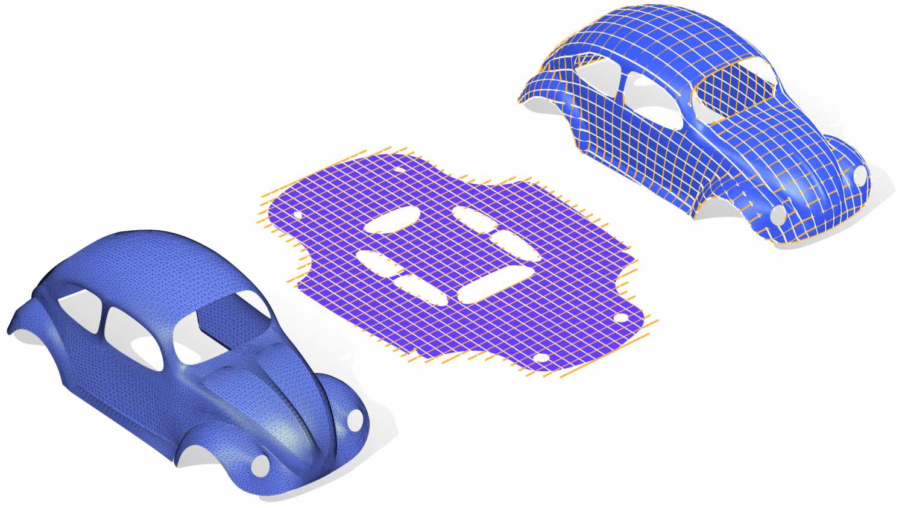

# Geometry Processing – Parameterization

> **To get started:** Clone this repository with
> 
>     git clone --recursive http://github.com/alecjacobson/geometry-processing-parameterization.git
>

## Installation, Layout, and Compilation

See
[introduction](http://github.com/alecjacobson/geometry-processing-introduction).

## Execution

Once built, you can execute the assignment from inside the `build/` by running
on a given mesh:

    ./parameterization [path to mesh with boundary.obj]

## Background

In this assignment we will explore how to _flatten_ a surface
[embedded](https://en.wikipedia.org/wiki/Embedding) (or even just
[immersed](https://en.wikipedia.org/wiki/Immersion)) in $\mathbb{R}^3$ to the flat
plane (i.e. $\mathbb{R}^2$).

This process is often referred to as
[parameterization](https://en.wikipedia.org/wiki/Parametrization#Parametrization_techniques)
because the two-dimensional coordinate system of the flattened mesh can now be
interpreted as a parameterization of the 3D surface.

A triangle mesh of a [VW
Beetle](https://en.wikipedia.org/wiki/Volkswagen_Beetle) is _parameterized_ by
flattening the mesh to the $uv$ -plane. There the $u$- and $v$- coordinates
(orange and white lines) can be directly interpreted as a parameterization of
the surface.

In this assignment, we are given a representation of the surface in 3D as a
[triangle mesh](https://en.wikipedia.org/wiki/Triangle_mesh) with a list of
$n$ vertex positions $\mathbf{V} \in  \mathbb{R}^{n \times  3}$, so then the goal is to assign $uv$
coordinates to each vertex $\mathbf{U} \in  \mathbb{R}^{n \times  2}$. 

In general, a 3D surface cannot be flattened onto the plane without
_**distortion**_. Some parts of the surface will have to be stretched and other
squished. Surfaces with [topological
handles](https://en.wikipedia.org/wiki/Handle_decomposition) or without [a
boundary](https://en.wikipedia.org/wiki/Surface_(topology)#Closed_surfaces) must be
cut. 

### Mass-spring methods

If we view our triangle mesh surface as a simple
[graph](https://en.wikipedia.org/wiki/Graph_(discrete_mathematics)) then the
surface flattening problem reduces to [graph
drawing](https://en.wikipedia.org/wiki/Graph_drawing). Distortion can be
measured in terms of the relative change in lengths between neighboring
vertices.

We can pose the graph drawing problem as an optimization over node locations so
that the lengths between neighboring vertices are minimized:

$$
\mathop{\text{min}}\_\mathbf{U}  \sum\limits_{\\{i,j\\} \in  \mathbf{E}} \|\| \mathbf{u}_i - \mathbf{u}_j\|\|^{2},
$$

where $\mathbf{E}\in \\{1,\ldots ,n\\}^{k \times  2}$ holds a list of edge indices into $\mathbf{V}$. This
energy has a physical interpretation as the [potential
energy](https://en.wikipedia.org/wiki/Potential_energy) of
[mass-spring](https://en.wikipedia.org/wiki/Simple_harmonic_motion#Mass_on_a_spring)
system. Each edge represents a spring with zero rest length, all springs have
uniform [stiffness](https://en.wikipedia.org/wiki/Hooke's_law#Spring_energy),
and all vertices have equivalent (unit) mass.

Without additional constraints, this minimization has a trivial solution: map
all vertices to the same point, e.g., $\mathbf{u}_i = (0\ 0),\ \forall  i$.

We can avoid this by fixing the mapping of certain vertices. If we choose these
fixed vertices arbitrarily we will in general get overlaps in the flattening.
For graph drawing this means that edges cross each other; for surface
parameterization this means that multiple triangles cover the same patch of the
$uv$-plane and some of those triangles are upside down. This problem is often
referred to as _fold overs_ or lack of
[injectivity](https://en.wikipedia.org/wiki/Injective_function).

 is
parameterized using a mass-spring system. More and more vertices are fixed
explicitly along the boundary. With only a few fixed vertices there are severe
overlaps and degeneracies in the interior. When the entire boundary is fixed to
the circle, there are no overlaps.](images/max-tutte-boundary.gif)

In 1963, [Tutte showed](https://en.wikipedia.org/wiki/Tutte_embedding) that if
the boundary of a disk-topology mesh is fixed to a [convex
polygon](https://en.wikipedia.org/wiki/Convex_polygon) (and all spring
stiffness are positive) then minimizing the energy above will result in an
injective (i.e., fold-over-free) flattening.

While avoiding fold-overs is important, Tutte-style mappings suffer from a
couple problems.

If uniform spring stiffness are used, then the mapping in the $uv$ domain will
try to make all edges the same length. Combined with the boundary constraints,
the flattened mesh will have smoothly varying edge-lengths and near-equilateral
triangles _regardless_ of the triangles shapes and sizes on the surface mesh.

We can try to remedy this by introducing a non-uniform weight or spring
stiffness  $w_{ij}$ for each edge $\\{i,j\\}$:

$$
\mathop{\text{min}}\_\mathbf{U}  \sum\limits_{\\{i,j\\} \in  \mathbf{E}} w_{ij} \|\| \mathbf{u}_i - \mathbf{u}_j\|\|^{2}.
$$

For example, we could weigh the distortion of shorter edges (on the 3D mesh)
more than longer ones: $w_{ij} = 1/\|\| \mathbf{v}_i - \mathbf{v}_j\|\| $. See ["Parametrization and
smooth approximation of surface triangulations" [Floater 1996]](papers/Floater97.pdf). This will at
best help tame _**length distortion**_. The "shapes" (i.e., aspect ratios) of
triangles will only be indirectly preserved. We need a way to discourage _area
distortion_ and _angle distortion_.

To do this, let's write the energy minimization problem above in matrix form:

$$
\mathop{\text{min}}_\mathbf{U} \frac12  \mathop{\text{tr}}{\left(\mathbf{U}^{\mathsf T} \mathbf{L} \mathbf{U}\right)},
$$

where $\mathbf{L} \in  \mathbb{R}^{n \times  n}$ is a sparse matrix with:

$$
L_{ij} = \begin{cases}
w_{ij} & \text{ if $i\ne j$ and $\exists  \\{ij\\} \in  \mathbf{E}$, }\\
-\sum\limits_{\ell\ne i} L_{i\ell} & \text{ if $i = j$, or } \\
0 & \text{ otherwise}
\end{cases}.
$$

> #### What's up with the $\mathop{\text{tr}}{\left(\right)}$ in the energy?
>
> The degrees of freedom in our optimization are a collected in the _matrix_
> $\mathbf{U} \in  \mathbb{R}^{n\times 2}$ with two columns. The energy is written as the
> [trace](https://en.wikipedia.org/wiki/Trace_(linear_algebra)) of the
> quadratic form (a.k.a. matrix) $\mathbf{Q} \in  \mathbb{R}^{n\times n}$ applied to $\mathbf{U}$. In effect,
> this is really applying $\mathbf{Q}$ to each column of $\mathbf{U}$ independently and summing the result:
>
> $$
\begin{align*}
\mathop{\text{tr}}{\left(\mathbf{U}^{\mathsf T} \mathbf{Q} \mathbf{U}\right)} &= \\
&= \mathop{\text{tr}}{\left(\mathbf{U}^{\mathsf T} \mathbf{Q} \mathbf{U}\right)} \\
&= {\mathop{\text{tr}}\left( {
\left[\begin{array}{c}
\mathbf{U}_1^{\mathsf T}\\
\mathbf{U}_2^{\mathsf T}
\end{array}\right] \mathbf{Q} [\mathbf{U}_1 \mathbf{U}_2] } \right)} \\
&= {\mathop{\text{tr}}\left( \begin{bmatrix}
\mathbf{U}_1^{\mathsf T} \mathbf{Q} \mathbf{U}_1 &
\mathbf{U}_1^{\mathsf T} \mathbf{Q} \mathbf{U}_2 \\
\mathbf{U}_2^{\mathsf T} \mathbf{Q} \mathbf{U}_1 &
\mathbf{U}_2^{\mathsf T} \mathbf{Q} \mathbf{U}_2 \end{bmatrix} \right)}
\\
&= \mathbf{U}_1^{\mathsf T} \mathbf{Q} \mathbf{U}_1 + \mathbf{U}_2^{\mathsf T} \mathbf{Q} \mathbf{U}_2.
\end{align*}
$$
>
> The benefits of energies written as the trace of a quadratic form applied to a
> matrix include: 1) each column can be optimized _independently_ (assuming
> constraints are also separable by column), and this is often the case when
> columns correspond to coordinates (u, v, etc.); and 2) the quadratic form for
> each columns is the same (the same $\mathbf{Q}$). For quadratic energy minimization,
> this means that we can precompute work (e.g., [Cholesky
> facotorization](https://en.wikipedia.org/wiki/Cholesky_decomposition)) on
> $\mathbf{Q}$ and take advantage of it for solving with $\mathbf{U}_1$ and $\mathbf{U}_2$ and we might
> even solve [in parallel](https://en.wikipedia.org/wiki/SIMD).

#### Dirichlet energy

We should immediately recognize this sparsity structure from the discrete
Laplacians considered in the previous assignments. If $w_{ij} = 1$, then $\mathbf{L}$
is the _uniform Laplacian_ (a.k.a., [graph
Laplacian](https://en.wikipedia.org/wiki/Laplacian_matrix)). If $w_{ij}$ is
based on edge-lengths, then $\mathbf{L}$ corresponds to a physical static equilibrium
problem for a linear spring system. 

But we have more information than edges: we know that our graph is really a
discrete representation of a two-dimensional surface. Wobbliness distortions in
the parameterization correspond to high _variation_ in the $u$ and $v$
functions over the surface.

We can model the problem of parametrization as an energy minimization of
the variation in the $u$- and $v$-coordinate functions over the surface $\mathbf{S}$:

$$
\mathop{\text{min}}\_{u,v} \int_\mathbf{S} \|\| {\nabla}u\|\|^{2} + \|\| {\nabla}v\|\|^{2} \ dA.
$$
 
This familiar energy is called the
[Dirichlet energy](https://en.wikipedia.org/wiki/Dirichlet's_energy).

We may discretize this problem immediately using [piecewise linear
functions](https://en.wikipedia.org/wiki/Piecewise_linear_function) spanned by
$u$ and $v$ values at vertices. This corresponds to using the _cotangent
Laplacian_ as $\mathbf{L}$ in the discrete minimization problem above.

> In the smooth setting, minimizing the variation of $u$ and $v$ will lead to
> an injective mapping if the boundary is constrained to a closed convex curve.
> In the discrete setting, poor triangle shapes in the original 3D mesh could
> lead to _negative_ cotangent weights $w_{ij}$ so the positive stiffness
> weight assumption of [Tutte's
> theorem](https://en.wikipedia.org/wiki/Tutte_embedding) is broken and
> fold-overs _might_ occur. Keep in mind that positive weights are a
> _sufficient_ condition for injectivity, but this [does not
> imply](https://en.wikipedia.org/wiki/Denying_the_antecedent) that having a
> few negative weights will necessarily cause a fold-over. Even so, Floater
> proposes an alternative discrete Laplacian in ["Mean value coordinates"](papers/Floater03.pdf) in
> 2003 that retains some nice shape-preserving properties without negative
> weights.

Modeling distortion as an integral of variation over the given 3D surface is
going in the right direction, but so far we are treating $u$ and $v$
_separately_. Intuitively $u$ and $v$ cannot "talk" to one-another during
optimization. There's no reason to expect that they will be able to minimize
_area distortation_ and _angle distortion_ directly. For that we will need to
consider $u$ and $v$ simultaneously.

### Least Squares Conformal Mappings

We can reason about distortion in terms of differential quantities of the
mapping from $\mathbf{S}$ to $\mathbb{R}^{2}$. Now, ultimately we are trying to parametrize $\mathbf{S}$
using the $u$ and $v$ coordinate functions spanning $\mathbb{R}^2$, but in order to
describe energies over these unknown functions we will assume (without
explicitly using) that we have a parameterization of $\mathbf{S}$ (e.g., with
coordinates $x$ and $y$). This way we can write about small changes in the
mapping function $u$ with respect to moving a small amount on the surface of
$\mathbf{S}$ (small changes in $x$ and $y$).

#### Area distortion

We would like that regions on $\mathbf{S}$ have a proportionally similarly sized region
under the $u$, $v$ mapping to $\mathbb{R}^{2}$. On an infinitesimal scale, a small change
in $x$ and $y$ on $\mathbf{S}$ should incur an equally small change in $u$ and $v$. In
other words, the [determinant of the
Jacobian](https://en.wikipedia.org/wiki/Jacobian_matrix_and_determinant) of the
mapping should be one:

$$
\left|
\begin{array}{cc}
\frac{\partial u}{\partial x} & \frac{\partial u}{\partial y} \\
\frac{\partial v}{\partial x} & \frac{\partial v}{\partial y} 
\end{array}
\right|
= 1,
$$

where $| \mathbf{X} | = \det{\mathbf{X}}$ for a square matrix $\mathbf{X}$.

> The determinant of the Jacobian of a mapping corresponds to the scale factor
> by which local area expands or shrinks. This quantity also appears during
> [integration by
> substitution](https://en.wikipedia.org/wiki/Integration_by_substitution) when
> multivariate functions are involved.

It is tempting to try to throw this equality into a least squares energy an
minimize it. Unfortunately the determinant is already a quadratic function of
$u$ and $v$ so a least-squares energy would be quartic and minimizing it would
be non-trivial. In the deformation assignment, we consider area-distortion
directly when looking for "as-rigid-as-possible" mappings. This idea can also be
applied to parameterization (also leading to a non-linear optimization).
But for this assignment, let us put aside area distortion and focus instead on
angle or aspect-ratio distortion. 

#### Angle distortion

We would also like that local regions on $\mathbf{S}$ are parameterized without
[shearing](https://en.wikipedia.org/wiki/Shear_mapping). This ensures that two
orthogonal directions on the surface $\mathbf{S}$ correspond to two orthogonal
directions on the parameteric plane $\mathbb{R}^{2}$. We can capture this by requiring
that a small change in the $x$ and $y$ directions on $\mathbf{S}$ corresponds to equal
magnitude, small changes in $u$ and $v$ in perpendicular directions:

$$
\begin{align*}
{\nabla}u &= {\nabla}v^\perp \\
&\downarrow \\
\begin{bmatrix}
\frac{\partial u}{\partial x} \\
\frac{\partial u}{\partial y} \\
\end{bmatrix}
 &=
\begin{bmatrix}
 \frac{\partial v}{\partial y} \\
-\frac{\partial v}{\partial x} \\
\end{bmatrix}
\end{align*}
$$

where $\mathbf{x}^\perp$ indicates the vector $\mathbf{x}$ rotated by $90^\circ$.

> By enlisting [complex
> analysis](https://en.wikipedia.org/wiki/Complex_analysis), we can reinterpret
> the mapping to the real plane $\mathbb{R}^{2}$ as a mapping to the [complex
> plane](https://en.wikipedia.org/wiki/Complex_plane) $\mathbb{C}$. The angle
> preservation equality above corresponds to the [Cauchy-Riemann
> equations](https://en.wikipedia.org/wiki/Cauchy–Riemann_equations). Complex
> functions that satisfy these equations are called [_**conformal
> maps**_](https://en.wikipedia.org/wiki/Conformal_map).

This equality is linear in $u$ and $v$. We can immediately build a quadratic
energy that minimizes deviation from satisfying this equation over the surface
$\mathbf{S}$ in a [least squares sense](https://en.wikipedia.org/wiki/Least_squares):

$$
\mathop{\text{min}}\_{u,v} \frac12  \int_\mathbf{S} \|\| {\nabla}u - {\nabla}v^\perp\|\|^{2} \ dA.
$$

This energy was employed for surface parameterization of triangle meshes as
early as ["Intrinsic parameterizations of surface meshes" [Desbrun et al. 2002]](papers/desbrun02.pdf)
and ["Least squares conformal maps for automatic texture atlas generation" [Lévy
et al. 2002]](papers/Levy02.pdf). Written in this form, it's perhaps not obvious how we can discretize
this over a triangle mesh. Let us massage the equations a bit, starting by
expanding the squared term:

$$
\int_\mathbf{S} \left(\frac12  \|\| {\nabla}u\|\|^{2} + \frac12  \|\| {\nabla}v\|\|^{2} - {\nabla}u \cdot  {\nabla}v^\perp \right)\ dA.
$$

We should recognize the first two terms as the [Dirichlet
energies](https://en.wikipedia.org/wiki/Dirichlet's_energy) of $u$ and $v$.  The third term is
at first glance not familiar. Let's massage it a bit by expanding the gradient
and dot product:

$$
\begin{align*}
\int_\mathbf{S}  {\nabla}u \cdot  {\nabla}v^\perp \ dA &= \\
\int_\mathbf{S} \left( \begin{array}{r}
\frac{\partial u}{\partial x} \\
\frac{\partial u}{\partial y} \\
\end{array}\right)\cdot 
\left( \begin{array}{r}
 \frac{\partial v}{\partial y} \\
-\frac{\partial v}{\partial x} \\
\end{array} \right) \ dA &= \\
\int_\mathbf{S} \left|
\begin{array}{cc}
\frac{\partial u}{\partial x} & \frac{\partial u}{\partial y} \\
\frac{\partial v}{\partial x} & \frac{\partial v}{\partial y} 
\end{array}
\right| \ dA &= 
\int_{\left(\begin{array}{c}u(\mathbf{S}) \\\\ v(\mathbf{S}) \end{array}\right)} 1 \ dA,
\end{align*}
$$

where we end up with the integrated [determinant of the
Jacobian](https://en.wikipedia.org/wiki/Jacobian_matrix_and_determinant) of the
$u$ and $v$ mapping over $\mathbf{S}$. By the rules of [integration by
substitution](https://en.wikipedia.org/wiki/Integration_by_substitution), this
is equivalent to integrating the unit density function over the image of the
mapping, i.e., the **_signed_** area of the flattened surface. If we apply
[divergence theorem](https://en.wikipedia.org/wiki/Divergence_theorem) we can
convert this area integral into a boundary integral:

$$
\int_{\left(\begin{array}{c}u(\mathbf{S}) \\\\ v(\mathbf{S}) \end{array}\right)} 1 \ dA
= \frac12  \oint_{\partial \left(\begin{array}{c}u(\mathbf{S}) \\\\ v(\mathbf{S}) \end{array}\right)} \mathbf{u}(s)\cdot \mathbf{n}(s) \ ds,
$$

where $\mathbf{n}$ is the unit vector pointing in the outward direction along the
boundary of the image of the mapping.

If we discretize $u$ and $v$ using piecewise-linear functions then the boundary
of the mapping will also be piecewise linear and the boundary integral for the
[**vector area**](https://en.wikipedia.org/wiki/Vector_area) is given by the sum over all
boundary edges of the integral of the position vector $\mathbf{u}$ dotted with that
edge's unit normal vector:

$$
\begin{align*}
\frac12  \oint_{\partial (\mathbf{u}(\mathbf{S}))} \mathbf{u}(s)\cdot \mathbf{n}(s) \ ds 
  &= \frac12  \sum\limits_{\{i,j\} \in  \partial \mathbf{S}} \int_0^1 
     (\mathbf{u}_i + t(\mathbf{u}_j - \mathbf{u}_i))\cdot \frac{(\mathbf{u}_j-\mathbf{u}_i)^\perp}{\|\| \mathbf{u}_j - \mathbf{u}_i\|\| } \
    \frac{ds}{dt}\  dt \\
  &= \frac12  \sum\limits\_{\{i,j\} \in  \partial \mathbf{S}} \int_0^1 
     (\mathbf{u}_i + t(\mathbf{u}_j - \mathbf{u}_i))\cdot \frac{(\mathbf{u}_j-\mathbf{u}_i)^\perp}{\|\| \mathbf{u}_j - \mathbf{u}_i\|\| } \
    \|\| \mathbf{u}_j - \mathbf{u}_i\|\|  \  dt \\
  &= \frac12  \sum\limits\_{\{i,j\} \in  \partial \mathbf{S}} \int_0^1  \mathbf{u}_i\cdot (\mathbf{u}_j-\mathbf{u}_i)^\perp  dt \\
  &= \frac12  \sum\limits\_{\{i,j\} \in  \partial \mathbf{S}} \| \mathbf{u}_i\  \mathbf{u}_j \|,
\end{align*}
$$

where finally we have a simply quadratic expression: sum over all boundary
edges the determinant of the matrix with vertex positions as columns. This
quadratic form can be written as $\mathbf{U}^{\mathsf T} \mathbf{A} \mathbf{U}$ with the _vectorized_
$u$- and $v$-coordinates of the mapping in $\mathbf{U} \in  \mathbb{R}^{2n}$ and $\mathbf{A} \in  \mathbb{R}^{2n \times 2n}$ a sparse matrix involving only values for vertices on the boundary of
$\mathbf{S}$. 

**_Achtung!_** A naive implementation of $\frac12  \sum \limits_{\{i,j\} \in  \partial \mathbf{S}} \| \mathbf{u}_i \mathbf{u}_j \|$ into matrix form $\mathbf{U}^{\mathsf T} \mathbf{A} \mathbf{U}$ will likely produce an
_asymmetric_ matrix $\mathbf{A}$. From a theoretical point of view, this is fine.
$\mathbf{A}$ just needs to compute the signed area of the flattened mesh. However, from
a numerical methods point of view we will almost always need our quadratic
coefficients matrix to be
[_symmetric_](https://en.wikipedia.org/wiki/Symmetric_matrix). Fortunately,
when a matrix is acting as a [quadratic
form](https://en.wikipedia.org/wiki/Quadratic_form) it is trivial to
_symmetrize_. Consider we have some asymmetric matrix $\tilde{\mathbf{A}}$ defining a
quadratic form: $\mathbf{x}^{\mathsf T} \tilde{\mathbf{A}} \mathbf{x}$. The output of a quadratic form is
just a scalar, so it's equal to its transpose: 

$$
\mathbf{x}^{\mathsf T} \tilde{\mathbf{A}} \mathbf{x} = \mathbf{x}^{\mathsf T} \tilde{\mathbf{A}}^{\mathsf T} \mathbf{x}.
$$

These are also equal to their average:

$$
\mathbf{x}^{\mathsf T} \tilde{\mathbf{A}} \mathbf{x} = 
\mathbf{x}^{\mathsf T} 
\underbrace{\frac12  (\tilde{\mathbf{A}} + \tilde{\mathbf{A}}^{\mathsf T})}_{\mathbf{A}}
\mathbf{x} = 
\mathbf{x}^{\mathsf T} \mathbf{A} \mathbf{x}
$$

Putting this together with the Dirichlet energy terms, we can write the
discrete _least squares conformal mappings_ minimization problem as:

$$
\mathop{\text{min}}\_{\mathbf{U} \in  \mathbb{R}^{2n}} 
  \mathbf{U}^{\mathsf T} 
  \underbrace{
  \left(
  \left(
  \begin{array}{rr}
    \mathbf{L} & 0 \\
    0 & \mathbf{L}
  \end{array}
  \right)
  \- \mathbf{A}
  \right)
  }\_{\mathbf{Q}}
  \mathbf{U},
$$

where $\mathbf{L} \in  \mathbb{R}^{n \times  n}$ is the Dirichlet energy quadratic form (a.k.a.
cotangent Laplacian) and $\mathbf{Q} \in  \mathbb{R}^{2n \times  2n}$ is the resulting (sparse)
quadratic form.

#### Free boundary

Similar to the mass-spring methods above, without constraints the least squares
conformal mapping energy will also have a trivial solution: set $\mathbf{U}$ to a
single point.

To avoid this solution, we _could_ "fix two vertices" (as originally suggested by
both [Desbrun et al. 2002] and [Lévy et al. 2002]). However, this will
introduce _bias_. Depending on the two vertices we choose we will get a different
solution.  If we're really unlucky, then we might choose two vertices that the
energy would rather like to place near each other and so placing them at
arbitrary positions will introduce unnecessary distortion (i.e., high energy).

Instead we would like [natural boundary
conditions](https://en.wikipedia.org/wiki/Natural_boundary_condition) (not to
be confused with [Neumann boundary
conditions](https://en.wikipedia.org/wiki/Neumann_boundary_condition)). Natural
boundary conditions minimize the given energy in the absence of explicit (or
_essential_) boundary conditions. Natural boundary conditions are convenient if
we discretize the energy _before_ differentiating to find the minimum. If our
discretization is "good", then natural boundary conditions will fall out for
free (_natural_ indeed!).

To obtain natural boundary conditions without bias _and_ avoid the trivial
solution, we can require that the solution:

  1. minimizes the given energy,
  2. has non-zero norm, and
  3. is [orthogonal](https://en.wikipedia.org/wiki/Orthogonality) to trivial
  solutions.

Let's break these down. The first requirement simply ensures that we're still
minimizing the given energy without [monkeying around with
it](https://en.wikipedia.org/wiki/Regularization_(mathematics)) in any way.

The second requirement adds the constraint that the solution $\mathbf{U}$ has _unit
norm_:

$$
\int_\mathbf{S} \|\| \mathbf{u}\|\|^{2} \ dA = 1.
$$

In our discrete case this corresponds to:

$$
\mathbf{U}^{\mathsf T} 
  \underbrace{\left(\begin{array}{cc}\mathbf{M} & 0 \\\\ 0 & \mathbf{M} \end{array}\right)}_{\mathbf{B}} 
  \mathbf{U} = 1,
$$

where $\mathbf{M} \in  \mathbb{R}^{n \times  n}$ is the _mass matrix_ for a piecewise-linear triangle
mesh and $\mathbf{B} \in  \mathbb{R}^{2n \times  2n}$ is the sparse, square constraint matrix

This is a _quadratic constraint_. Normally that would be [bad
news](https://en.wikipedia.org/wiki/The_Bad_News_Bears), but this type of
constraint results in a well-studied [generalized Eigen value
problem](https://en.wikipedia.org/wiki/Eigendecomposition_of_a_matrix#Generalized_eigenvalue_problem).

> ##### Generalized Eigenvalue problem 
>
> Consider a discrete quadratic minimization problem in $\mathbf{v} \in  \mathbb{R}^n$:
>
> $$
\mathop{\text{min}}_{\mathbf{v}} \frac12  \mathbf{v}^{\mathsf T} \mathbf{A} \mathbf{v} \text{ subject to } \mathbf{v}^{\mathsf T} \mathbf{B} \mathbf{v} = 1,
$$
>
> where $\mathbf{A},\mathbf{B} \in  \mathbb{R}^{n \times  n}$ are [positive
> semi-definite](https://en.wikipedia.org/wiki/Positive-definite_matrix#Positive-semidefinite)
> matrices.
>
> We can enforce this constraint via the [Lagrange multiplier
> method](https://en.wikipedia.org/wiki/Lagrange_multiplier) by introducing the
> scalar Lagrange multiplier ${\lambda}$ and looking for the saddle-point of the
> _Lagrangian_:
> 
> $$
\mathcal{L}(\mathbf{v},{\lambda}) = \frac12  \mathbf{v}^{\mathsf T} \mathbf{A} \mathbf{v} + {\lambda} (1 - \mathbf{v}^{\mathsf T} \mathbf{B} \mathbf{v} ).
$$
>
> This occurs when $\partial \mathcal{L}/\partial \mathbf{v} = 0$ and $\partial \mathcal{L}/\partial {\lambda} = 0$:
>
> $$
\mathbf{A} \mathbf{v} - {\lambda} \mathbf{B} \mathbf{v} = 0 \Rightarrow \mathbf{A} \mathbf{v} = {\lambda} \mathbf{B} \mathbf{v}
$$
>
> $$
1 - \mathbf{v}^{\mathsf T} \mathbf{B} \mathbf{v} = 0 \Rightarrow \mathbf{v}^{\mathsf T} \mathbf{B} \mathbf{v} = 1. \\
$$
>
> This is the canonical form of the 
> [generalized Eigen value
> problem](https://en.wikipedia.org/wiki/Eigendecomposition_of_a_matrix#Generalized_eigenvalue_problem)
> for which there are available numerical algorithms.

Finally, our third constraint is that the solution is orthogonal to the trivial
solutions. There are _two_ trivial solutions. They correspond to mapping all
$u$ values to zero and all $v$ values to a constant-but-non-zero value and
[_vice-versa_](https://en.wikipedia.org/wiki/List_of_Latin_phrases_(V)#vice_versa).
These solutions will have _zero_ energy and thus their corresponding
eigenvalues ${\lambda}$ will be zero. The _next_ eigenmode (with next smallest
eigenvalue) will satisfy all of our criteria. See ["Spectral conformal
parameterization" [Mullen et al. 2008]](papers/Mullen08.pdf).

> This eigenvector is sometimes called the [Fiedler
> vector](https://en.wikipedia.org/wiki/Algebraic_connectivity#Fiedler_vector).

#### Canonical rotation

The least squares conformal mapping energy is _invariant_ to translation and
rotation. The eigen decomposition process described above will naturally take
care of "picking" a canonical translation by pulling the solution $\mathbf{U}$ toward
the origin. The rotation it returns, however, will be arbitrary.

We can try to find a canonical rotation by using [principle component
analysis](https://en.wikipedia.org/wiki/Principal_component_analysis) on the
returned $uv$ coordinates in $\mathbf{U} \in  \mathbb{R}^{n \times  2}$ (where now $\mathbf{U}$ places all $u$
coordinates in the first column and $v$ coordinates in the second column). 

For mappings with strong reflectional symmetry then singular value
decomposition on the [covariance
matrix](https://en.wikipedia.org/wiki/Covariance) $\mathbf{U}^{\mathsf T} \mathbf{U} \in  \mathbb{R}^{2 \times 2}$ will produce a rotation that aligns the principle direction of $\mathbf{U}$ with the " $x$ "-axis of the parametric domain.

##### Why is everything squished up in the interior?

If the surface has only a small boundary then _all_ of the surface will have to
be packed inside the interior. We're not directly punishing _area_ distortion
so in order to satisfy the _angle_ distortion. _Freeing_ the boundary helps a
little, but ultimately the only way to mitigate this is to: 1) trade area
distortion for angle distortion or 2) _cut_ (a.k.a. "interrupt") the mapping
with discontinuities (see, e.g., [Goode homolosine projection used for maps of
Earth](https://en.wikipedia.org/wiki/Goode_homolosine_projection)).

Cutting new boundaries is _always_ necessary for parameterizing _closed_
surfaces. There has been much work in the last few years on choosing cuts
automatically, many of which are good candidates for a final implementation
project.

## Tasks

### Blacklist

 - `igl::harmonic`
 - `igl::lscm`
 - `igl::vector_area_matrix`

### Whitelist

 - `igl::boundary_loop`
 - `igl::cotmatrix` (or your previous implementation)
 - `igl::eigs` (Use the `igl::EIGS_TYPE_SM` type)
 - `igl::map_vertices_to_circle`
 - `igl::massmatrix` (or your previous implementation)
 - `igl::min_quad_with_fixed` (for minimizing a quadratic energy subject to
     fixed value constraints)
 - `igl::repdiag`

### `src/tutte.cpp`

Given a 3D mesh (`V`,`F`) with a disk topology (i.e., a manifold with single
boundary), compute a 2D parameterization according to Tutte's mapping inside
the unit disk. All boundary vertices should be mapped to the unit circle and
interior vertices mapped inside the disk _without_ flips.

### `src/vector_area_matrix.cpp`

Constructs the symmetric area matrix `A`, s.t.  `[V.col(0)' V.col(1)'] * A *
[V.col(0); V.col(1)]` is the **vector area** of the mesh (`V`,`F`).

### `src/lscm.cpp`

Given a 3D mesh (`V`,`F`) with boundary compute a 2D parameterization that
minimizes the "least squares conformal" energy:

$$
\int_\mathbf{S} \|\|  {\nabla}v - ({\nabla}u)^\perp \|\|^{2} \ dA,
$$

where $u$ and $v$ are the unknown (output) coordinates in the parametric domain
`U`.

Use eigen-decomposition to find an un-biased, non-trivial minimizer. Then use
singular value decomposition to find a canonical rotation to line the principle
axis of $\mathbf{U}$ with the $x$-axis of the parametric domain.
